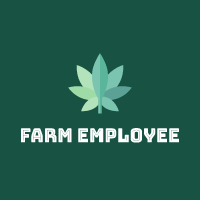

<div id="top"></div>

<!-- PROJECT LOGO -->
<br />
<div align="center">

   

  <p align="center">
    HIRING EMPLOYEES SYSTEM FOR FARMERS 
    <br />
    <a href="https://github.com/iliophanis/farm-employee/blob/main/documentation/analysis.txt"><strong>Docs</strong></a>
    <br />
    <br />
    <!-- <a href="https://github.com/iliophanis/farm-employee">View Demo</a>
    · -->
    <a href="https://github.com/iliophanis/farm-employee/issues">Report Bug</a>
    ·
    <a href="https://github.com/iliophanis/farm-employee/issues">Request Feature</a>
  </p>
</div>

<!-- TABLE OF CONTENTS -->
<details>
  <summary>Table of Contents</summary>
  <ol>
     <li><a href="#er-diagram">ER Diagram</a></li>
     <li><a href="#contributors">Contributors</a></li>
    <li>
      <a href="#about-the-project">About The Project</a>
      <ul>
        <li><a href="#built-with">Built With</a></li>
      </ul>
    </li>
    <li>
      <a href="#getting-started">Getting Started</a>
      <ul>
        <li><a href="#prerequisites">Prerequisites</a></li>
        <li><a href="#project-installation">Installation</a></li>
        <li><a href="#run-project">Run Project</a> </li>
        <li><a href="#deploy-project">Deploy Project</a> </li>
      </ul>
    </li>
    <li><a href="#roadmap">Roadmap</a></li>
    <li><a href="#ci-cd-rules">CI/CD Rules</a></li>
  </ol>
</details>

## ER Diagram
*  file documentation/Farm Employee ER.drawio

## Contributors
* Ελευθερία Ντούλια Α.Μ.: 3180129
* Πελαγία Ροδίτη Α.Μ.: 3190346
* Ηλίας Θεοφάνης Γραββάνης Α.Μ.: 3200248

<!-- ABOUT THE PROJECT -->

## About The Project
#### Git configuration for Windows 
```
git config core.ignorecase false
```
#### Development Brach and working with Pull Request (https://github.com/iliophanis/farm-employee)
```
develop
```

#### Release Branch and Working with merge from develop branch
```
master
```

### Swagger Server Documentation
```
Swagger Endpoint in Dev http://localhost:5000/swagger/
```

[![Documents Screen Shot][product-screenshot]]()

<p align="right">(<a href="#top">back to top</a>)</p>

### Built With

This section should list any major frameworks/libraries used to bootstrap your project. Leave any add-ons/plugins for the acknowledgements section.

- [Next.js](https://nextjs.org/)
- [React Query](https://react-query.tanstack.com/)
- [Recoil](https://recoiljs.org/docs/introduction/installation)
- [Tailwind Css](https://tailwindcss.com/)
- [.NET](https://docs.microsoft.com/en-us/dotnet/fundamentals/)
- [Entity-Framework MySQL](https://learn.microsoft.com/en-us/ef/core/get-started/overview/install)

<p align="right">(<a href="#top">back to top</a>)</p>

<!-- GETTING STARTED -->

## Getting Started

This is instructions on setting up your project locally.
To get a local copy up and running follow these steps.

### Prerequisites

Install dotnet 6 sdk - SDK 6.0.407 (The latest)

- https://dotnet.microsoft.com/en-us/download/dotnet/6.0 

Installl latest node - npm and yarn globally ,also if need upate node version minimum 15.0.0.
- https://nodejs.org/en - LTS Version

- yarn 
  ```sh 
  npm install -g yarn
  ```

### Project Installation

# client
1. yarn install
2. yarn dev

# server
1. dotnet restore
2. dotnet watch run

# server db scaffolding
* [.net scaffold docs](https://learn.microsoft.com/en-us/ef/core/managing-schemas/scaffolding/?tabs=dotnet-core-cli)
```sh
 dotnet ef dbcontext scaffold "Server=localhost;User=root;Password=;Database=farm_employee" "Pomelo.EntityFrameworkCore.MySql" --context DataContext --context-dir Data --output-dir .\Data\Entities\ --no-onconfiguring
```

TODO

<p align="right">(<a href="#top">back to top</a>)</p>

### Run Project

TODO

<p align="right">(<a href="#top">back to top</a>)</p>

### Deploy Project

TODO

<p align="right">(<a href="#top">back to top</a>)</p>

<!-- ROADMAP -->

## Roadmap

- [x] Add ER diagram in [flowchart](https://app.diagrams.net/)
- [ ] Business Requirements - Use cases of project
- [ ] Add clickup for Agile - Set ticketing system , sprints
- [ ] Create Template for backend , frontend
- [ ] Deploy - Testing (Unit - E2E)
- [ ] Add Changelog (i.e Version sections with break changes in description)
  
See the [open issues](https://github.com/iliophanis/farm-employee) for a full list of proposed features (and known issues).

<p align="right">(<a href="#top">back to top</a>)</p>

<!-- CI/CD -->

## CI CD Rules

1. Clone the Project
2. Create your Branch
  - feature (`git checkout -b feature/{TickectName}`) - Add new functionality in project
  - bug  (`git checkout -b bug/{TickectName}`) - The bug which needs to be fixed soon
  - wip  (`git checkout -b wip/{TickectName}`) - The work is in progress, and I am aware it will not finish soon
3. Commit your Changes (`git commit -m '{message}'`)
4. Push to the Branch (`git push origin feature/{TickectName}`)
5. Open a Pull Request

<p align="right">(<a href="#top">back to top</a>)</p>


## EmailService Provider
### Development Environment
  - website  : https://ethereal.email/
  - smtp : smtp.ethereal.email
  - port : 587
  - name : lexus.mckenzie@ethereal.email
  - password: TYbtnjxdXaUTypy8mP

### Production Environment
  - website  : https://mail.google.com/
  - port : 465 
  - smtp : smtp.gmail.com
  - name : lexus.mckenzie@ethereal.email
  - password: TYbtnjxdXaUTypy8mP
